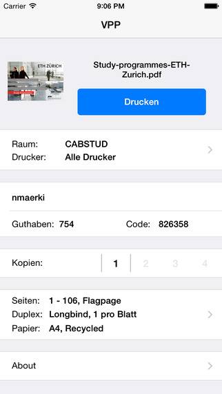

# ETHZ VPP

A simple iOS client to print PDF documents using the network printers at ETH Zurich.

During my time at ETH Zurich I built and often used this app. As I have completed my studies, I don't plan to maintain it any longer and therefore make the source code available.

## Notes

1. The compiled app is available in the [App Store](https://itunes.apple.com/ch/app/ethz-vpp-printer/id404572534?mt=8]).
2. This was a fun project and a playground for Swift and other experiments. I didn't invest much time in code quality.
3. The backend won't be open-sourced. Build your own and update BACKEND_API_PATH everywhere.

## Contact

[@nmaerki](https://twitter.com/nmaerki)
